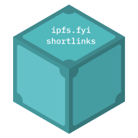

# 📇 ipfs.fyi shortlinks



ipfs.fyi is a short link service that uses the [**`_redirects`**](./_redirects) file to configure redirections.

It allows creating shortlinks with the `ipfs.fyi` domain

## Example

To redirect from **`ipfs.fyi/blog`** ➡️ `https://blog.ipfs.tech` with an HTTP `301` code, add the following line to [**`_redirects`**](./_redirects) :

```
/blog   https://blog.ipfs.tech  301
```

## `_redirects` file syntax

[`_redirects` syntax docs](https://docs.netlify.com/routing/redirects/redirect-options/)

